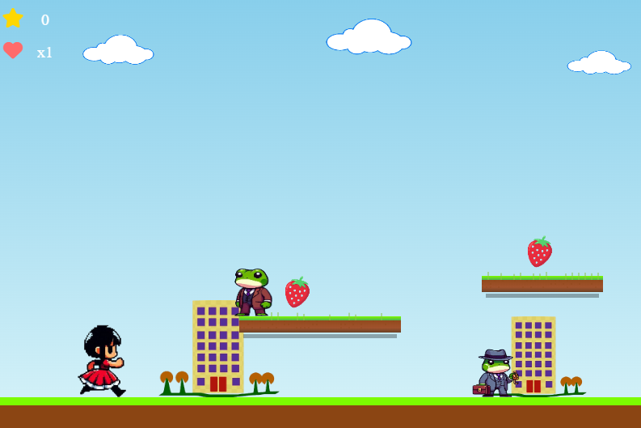

# 🎮 Jogo Educativo - Aprendizado Divertido



## 📌 Sobre o Projeto

Este é um jogo educativo desenvolvido em **JavaScript**, com o objetivo de tornar o aprendizado mais interativo e divertido para crianças. O jogo apresenta desafios que estimulam o raciocínio lógico, coordenação motora e conhecimentos gerais.

## 🚀 Tecnologias Utilizadas

- **JavaScript** - Para a lógica do jogo.
- **HTML5 Canvas** - Para renderização gráfica.
- **CSS3** - Para estilização e animações.

## 🎯 Objetivo do Jogo

Os jogadores devem completar desafios relacionados a [tema do jogo] enquanto exploram um ambiente colorido e dinâmico. O jogo oferece feedback positivo para incentivar o aprendizado contínuo.

## 🕹️ Como Jogar

1. Abra o arquivo `index.html` no seu navegador.
2. Utilize o teclado e/ou mouse para interagir com o jogo.
3. Complete os desafios e avance para os próximos níveis!

## 📌 Como Executar o Projeto

1. Clone este repositório:
   ```bash
   git clone https://github.com/charliehenrikis/game-js
   ```
2. Acesse a pasta do projeto:
   ```bash
   cd nome-do-projeto
   ```
3. Abra o arquivo `index.html` no navegador.

## 🔥 Recursos e Funcionalidades

- 🌟 Gráficos interativos e coloridos
- 🎵 Efeitos sonoros dinâmicos
- 🏆 Sistema de pontuação
- 🎓 Fases progressivas para aprendizado contínuo

## 📌 Contribuição

Sinta-se à vontade para contribuir com melhorias no código, novos desafios ou funcionalidades para o jogo.

1. Faça um fork do projeto
2. Crie um branch com sua funcionalidade: `git checkout -b minha-feature`
3. Commit suas mudanças: `git commit -m 'Adiciona nova funcionalidade'`
4. Envie para o branch principal: `git push origin minha-feature`
5. Abra um Pull Request

## 📜 Licença

Este projeto está licenciado sob a licença MIT - veja o arquivo [LICENSE](LICENSE) para mais detalhes.

---

Desenvolvido por Charlie Henrikis 🚀

